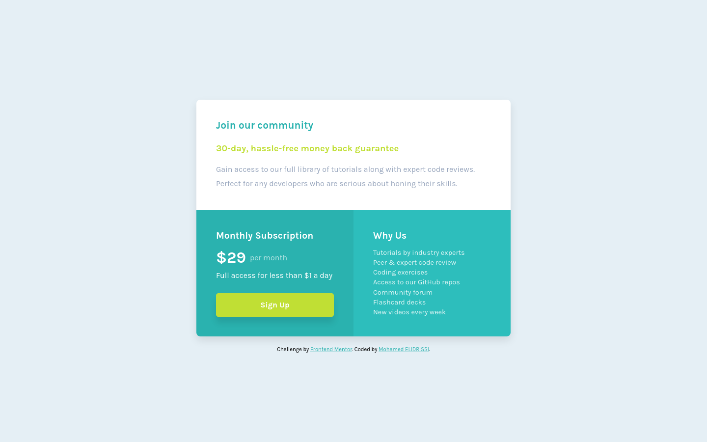

# Frontend Mentor - Single price grid component solution

This is a solution to the [Single price grid component challenge on Frontend Mentor](https://www.frontendmentor.io/challenges/single-price-grid-component-5ce41129d0ff452fec5abbbc). Frontend Mentor challenges help you improve your coding skills by building realistic projects. 

## Table of contents

- [Overview](#overview)
  - [The challenge](#the-challenge)
  - [Screenshot](#screenshot)
- [My process](#my-process)
  - [Built with](#built-with)
- [Author](#author)
- [License](#license)

## Overview

### The challenge

Users should be able to:

- View the optimal layout for the component depending on their device's screen size
- See a hover state on desktop for the Sign Up call-to-action

### Screenshot

| Mobile (375px) | Desktop (1440px) |
--- | ---
|  |  |

### Links

- [Solution URL](https://www.frontendmentor.io/solutions/pure-css-with-parcel-bundler-MuYocMCWd)
- [Live Site URL](https://single-price-grid-component-elidrissidev.vercel.app/)

## My process

### Built with

- Semantic HTML5 markup
- CSS custom properties
- Flexbox
- Mobile-first workflow
- [Parcel](https://parceljs.org/)

## Author

- Website - [Mohamed ELIDRISSI](https://www.elidrissi.dev)
- Frontend Mentor - [@elidrissidev](https://www.frontendmentor.io/profile/elidrissidev)

## License

This project is licensed under the [MIT License](LICENSE.txt)
